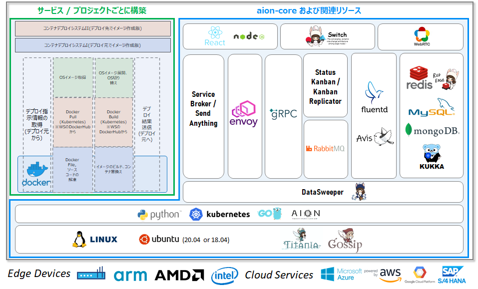
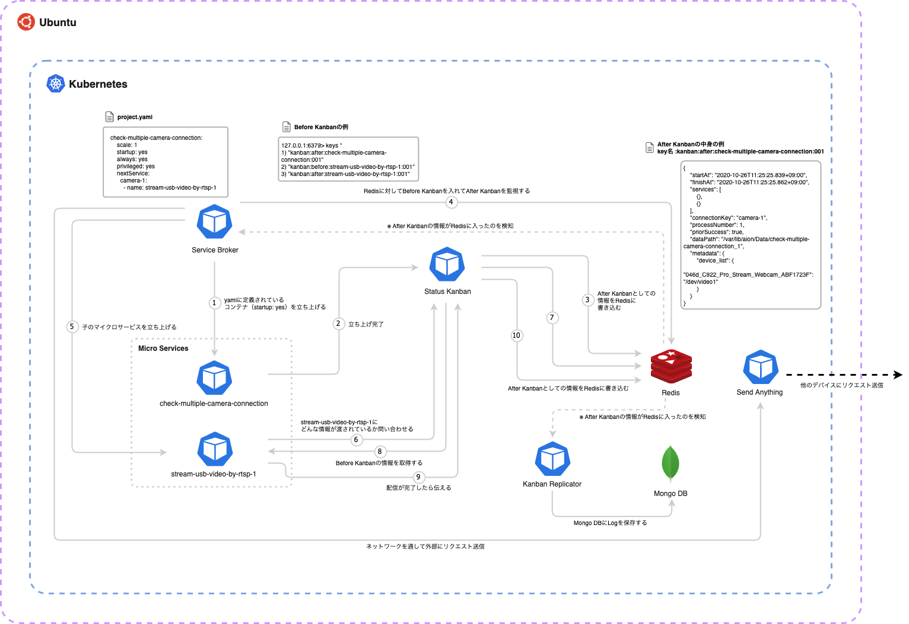
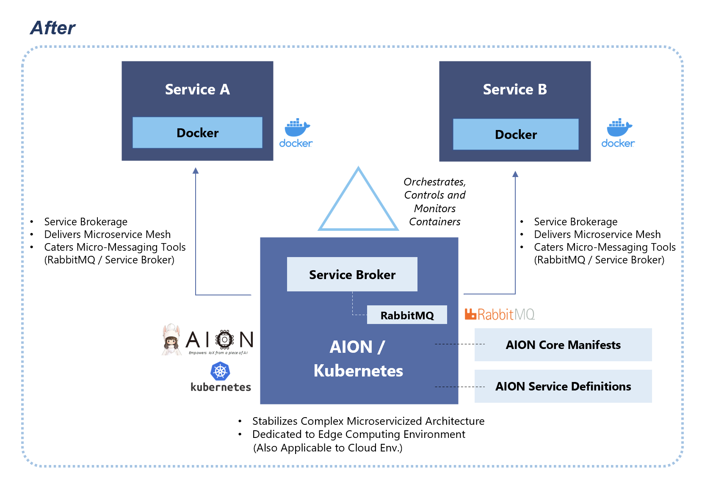
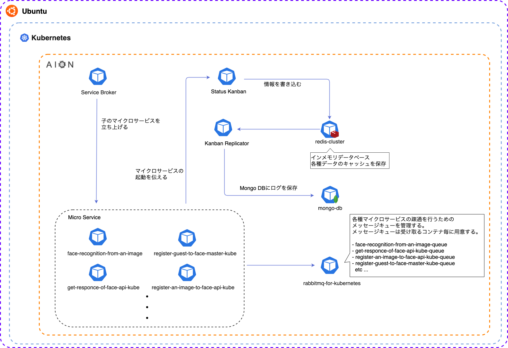
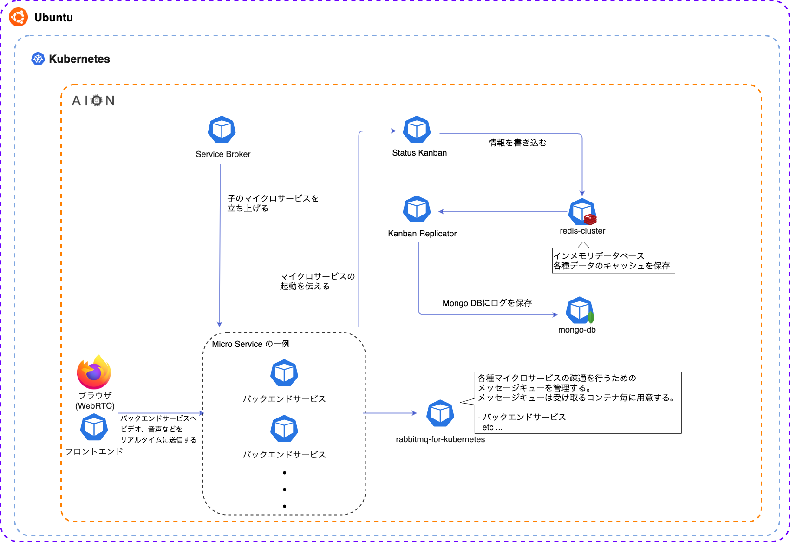
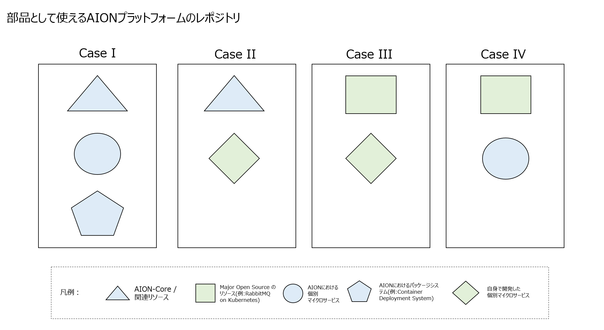
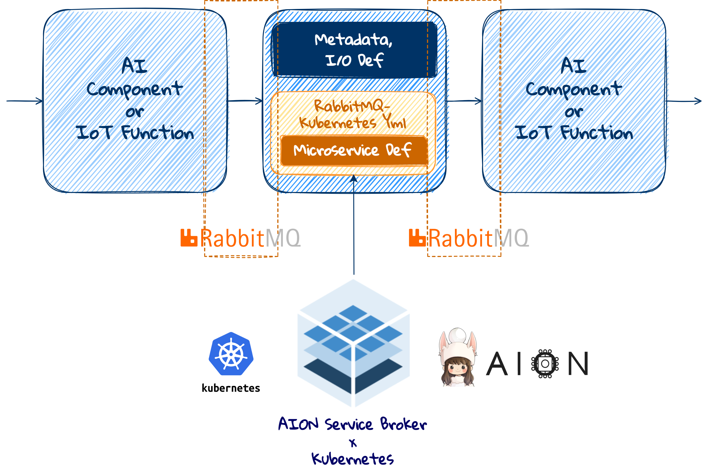
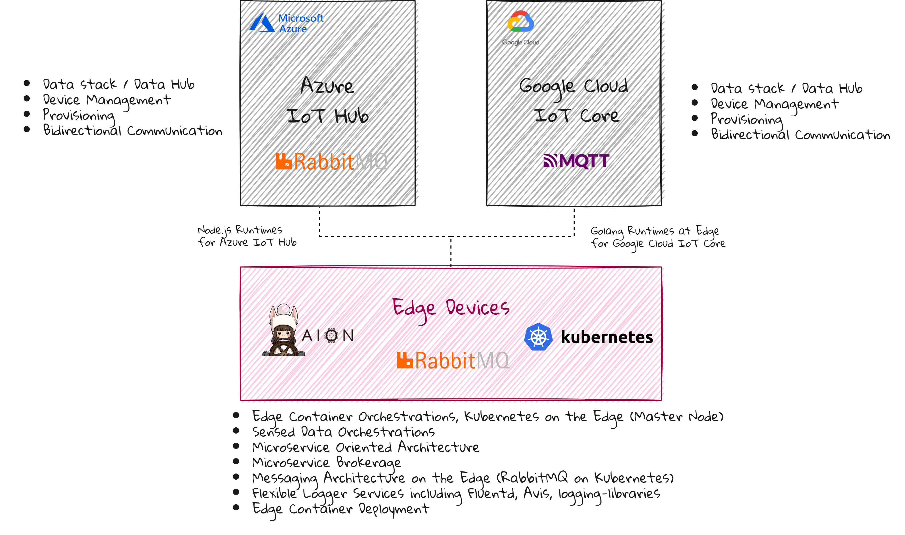

<p align="center">
  
</p>
<p align="center">
Empowers&nbsp;IoX&nbsp;from&nbsp;a&nbsp;piece&nbsp;of&nbsp;AI.
</p>

***  

# aion-core

aion-core は、主にエッジコンピューティング向けの マイクロサービスアーキテクチャ・プラットフォームである AION を動作させるのに必要な オープンソースレポジトリ です。

aion-core は、以下のリソースを提供しています。

* AIONのメインコンポーネント
* AIONの関連ライブラリ等
* Kubernetesの初期設定・デプロイに必要な設定ファイル

aion-core の動作方法として、単体のマシンで動作するシングルモードと、複数のマシンでクラスタ構成をとるクラスタモードの、2通りの動作方法があります。  
シングルモードでは、エッジコンピューティング環境の単体のマシンに Kubernetes の Master Node のみが構成され動作します。  
クラスタモードでは、主にエッジコンピューティング環境の複数のマシンでにわたって、 Kubernetes の Master Node と Wokrer Nodes が構成され動作します。

**目次**

* [動作環境](#動作環境)
* [AIONの概要](#AIONの概要)
* [AIONのアーキテクチャ１](#AIONのアーキテクチャ１)
* [AIONのアーキテクチャ２](#AIONのアーキテクチャ２)
* [AIONのアーキテクチャ３](#AIONのアーキテクチャ３)
* [AIONの主要構成](#AIONの主要構成)
    * [Service Broker](#ServiceBroker)
    * [Status Kanban および Kanban Replicator](#StatusKanbanおよびKanbanReplicator)
    * [Send Anything](#SendAnything)
    * [Data Sweeper](#DataSweeper)
    * [Avis](#Avis)
* [AIONにおけるミドルウェアとフレームワーク](#AIONにおけるミドルウェアとフレームワーク)
    * [RabbitMQ](#RabbitMQ) 
    * [Fluentd](#Fluentd)  
    * [Redis](#Redis)
    * [Envoy](#Envoy)  
    * [MongoDB](#MongoDB)
    * [MySQL](#MySQL)
    * [WebRTC](#WebRTC)
    * [gRPC](#gRPC)
    * [ReactJS](#ReactJS)
* [AIONにおけるマイクロサービスアーキテクチャ](#AIONにおけるマイクロサービスアーキテクチャ)
* [AIONを用いたシステム構成の例](#AIONを用いたシステム構成の例)
    * [AION のメッセージングアーキテクチャ（RabbitMQ）](#AIONのメッセージングアーキテクチャ（RabbitMQ）)
    * [AION のアーキテクチャの一例（WebRTC）](#AIONのアーキテクチャの一例（WebRTC）)
* [AIONのランタイム環境](#AIONのランタイム環境)
* [AIONプラットフォームのレポジトリの分類](#AIONプラットフォームのレポジトリの分類)
* [部品として使えるAIONプラットフォームのレポジトリ](#部品として使えるAIONプラットフォームのレポジトリ)
* [AIONプラットフォームにおけるAI/IoT環境のためのデータパイプライン](#AIONプラットフォームにおけるAI/IoT環境のためのデータパイプライン)
* [AIONプラットフォームにおけるエッジとクラウドとのデータ統合](#AIONプラットフォームにおけるエッジとクラウドとのデータ統合)  
* [シングルモードとクラスタモード](#シングルモードとクラスタモード)
    * [シングルモード](#シングルモード)
    * [クラスタモード](#クラスタモード)
* [セットアップ(シングルモード/クラスタモード共通)](#セットアップ(シングルモード/クラスタモード共通))
    * [Hostnameの設定](#Hostnameの設定)
    * [ディレクトリの作成](#ディレクトリの作成)
    * [Kubernetesのインストール](#1.Kubernetesのインストール)
    * [AIONのセットアップ](#AIONのセットアップ)
    * [aion-core-manifestsの配置](#aion-core-manifestsの配置)
    * [services.ymlの設定](#services.ymlの設定)
    * [aion-core-manifestsのビルド・修正(シングルモード/クラスタモードで異なります)](#aion-core-manifestsのビルド・修正(シングルモード/クラスタモードで異なります))
* [Master Nodeの構築(シングルモード/クラスタモードのMaster)](#Master-nodeの構築)
    * [1.Kubeadmでセットアップ](#1kubeadmでセットアップ)
    * [2.Flannelをデプロイする](#2flannelをデプロイする)
    * [3.Master Nodeの隔離を無効にする](#3master-nodeの隔離を無効にする)
    * [4.Master Nodeがクラスターに参加していることを確認する](#4master-nodeがクラスターに参加していることを確認する)
    * [5.(クラスタモードのみ)aionctlのインストール](#aionctlのインストール)
* [Worker Nodeの構築(クラスタモードのWorker)](#Worker-nodeの構築)
    * [1.ノードをワーカーノードとしてclusterに参加させる](#1ノードをワーカーノードとしてclusterに参加させる)
    * [2.secret情報をconfigに書き込む](#2secret情報をconfigに書き込む)
    * [3.参加したクラスターにaion-coreをdeploy](#3参加したクラスターにaion-coreをdeploy)
* [AIONの起動と停止（シングルモード/クラスタモード共通）](#AIONの起動と停止（シングルモード/クラスタモード共通）)
    * [起動](#起動)
    * [停止](#停止)
* [aion-core の起動と停止（シングルモード/クラスタモード共通）](#aion-core-の起動と停止（シングルモード/クラスタモード共通）)
    * [起動](#起動)
    * [停止](#停止)

## 動作環境
aion-core、関連リソースならびにエッジアプリケーションやマイクロサービス等を、安定的に動作させるには、以下の環境であることを前提とします。  

* OS: Linux
* CPU: ARM/AMD/Intel  
* Memory: 8GB 以上推奨 （Jetson であれば TX2 / NX 以上、Raspberry Pi であれば RP4 8GB Model、が該当します）
* Storage: 64GB 以上推奨 (OS領域とは別に主にコンテナイメージ実装・稼働のために必要です。通常のエッジ端末で64GBを確保するには、外付けMicroSDやSSDが必要です）   

## AIONの概要
AIONは、100% Linux のオープンソース環境をベースとして開発・構築された、主にエッジコンピューティングのための、マイクロサービス志向のコンピューティング・プラットフォーム環境です。  
エッジ端末内において、ほぼ全てのマイクロサービス・ミドルウェアがコンテナ化されコンテナオーケストレーションシステムのKubernetesによって制御・監視されています。  

## AIONのアーキテクチャ１
AION の アーキテクチャ概要図 です。  


## AIONのアーキテクチャ２
aion-core の メッセージングアーキテクチャ（カンバンシステム） の 図 です。（最新版のAIONでは、status-kanbanとkanban-replicator による メッセージングアーキテクチャは、RabbitMQ に置き換わっています）    
  

## AIONのアーキテクチャ３
AIONプラットフォームのリソースを実装構築した、エッジコンピューティングアーキテクチャの例（OMOTE-Bakoアプリケーションのアーキテクチャ）です。  


## AIONの主要構成  

AIONでは、主要構成として以下があります。 
Service Broker、Status Kanban および Kanban Replicator、Send Anything は、aion-core に含まれます。  

- Service Broker
- Status Kanban および Kanban Replicator
- Send Anything
- Data Sweeper
- Avis

### Service Broker
 
[Service Broker](https://github.com/latonaio/aion-core/tree/main/cmd/service-broker)は、AION™のコア機能で、主にエッジコンテナオーケストレーション環境でのマイクロサービスの実行に関する統括制御をつかさどるモジュールです。  
AIONでは、Service Broker はそれ自体がマイクロサービスとして機能します。  
 
### Status Kanban および Kanban Replicator
 
[Status Kanban](https://github.com/latonaio/aion-core/tree/main/cmd/kanban-server) および [Kanban Replicator](https://github.com/latonaio/aion-core/tree/main/cmd/kanban-replicator)は、それぞれAION™のコア機能の1つで、マイクロサービス間のかんばんのやりとりを制御します。AION™　にはカンバンロジックがあらかじめ含まれているため、コンピューティングリソースとストレージリソースが制限されたエッジで、1、10、または100ミリ秒のタイムサイクルでエンドポイントの高性能処理を実行できます。マイクロサービス（マイクロサービスA>マイクロサービスB>マイクロサービスCなど）の各連続処理に割り当てられたAまたは一部のカンバンカードは、エッジでのIoTおよびAI処理における大量の同時注文の一貫性とモデレーションを厳密に維持します。    
AIONでは、Status Kanban および Kanban Replicator は各々それ自体がマイクロサービスとして機能します。  

### Send Anything
 
[Send Anything](https://github.com/latonaio/aion-core/tree/main/cmd/send-anything)は、エッジのAION™プラットフォームでソフトウェアのコアスタック専用に機能する統合カンバンネイティブデータ処理システムを提供します。  
Send Anything によるクロスデバイスかんばん処理システムは、AION™サービスブローカーによってオーケストレーションされ、多数のネットワークノード全体で、マイクロサービス指向アーキテクチャのデータ処理/インターフェースとアプリケーションのランタイムの柔軟なパターンを可能にします。  
AIONでは、Send Anything はそれ自体がマイクロサービスとして機能します。  

### Data Sweeper
 
[Data Sweeper](https://github.com/latonaio/data-sweeper-kube)は、マイクロサービスが生成した不要なファイルを定期的に削除する機能を提供します。これにより、ストレージリソースをクリーンアップして、エッジアプリケーションの実行時環境を安定かつ適度に保つことが可能になります。また、Data Sweeperはセキュリティブローカーとしても機能し、デバイス上の個人情報を自動的に消去することで、非常に安全なエッジ環境を確保し、個人のデータが外部に漏洩しないようにします。     
AIONでは、Data Sweeper はそれ自体がマイクロサービスとして機能します。  

### Avis  

[Avis](https://github.com/latonaio/avis)は、Fluentdを用いてマイクロサービスログやアクセスログ、システムログ等を収集し、収集されたログから重要なログをピックアップしてUI上に表示します。  
UI は Electron をベースとしており、カスタマイズが容易で、直感的で洗練されたUIとなっています。  
AIONでは、Avis はそれ自体がマイクロサービスとして機能します。  


## AIONにおけるミドルウェアとフレームワーク

AIONでは以下のミドルウェアとフレームワークを採用しております。 

- [RabbitMQ](https://github.com/rabbitmq?q=core&type=&language=&sort=)  
- [Fluentd](https://github.com/fluent)    
- [Redis](https://github.com/redis)
- [Envoy](https://github.com/envoyproxy)
- [MongoDB](https://github.com/mongodb)  
- [MySQL](https://github.com/mysql)
- [WebRTC](https://github.com/webrtc)
- [gRPC](https://github.com/grpc)
- [ReactJS](https://github.com/reactjs)

### RabbitMQ

AIONでは、AION がカンバンシステムと呼んでいる、マイクロサービス間のメッセージングアーキテクチャのコアアーキテクチャとして、RabbitMQ を採用しています。    
AION のカンバンシステムは、コンピューティングリソースとストレージリソースが制限されたエッジ環境で、1/10/100ミリ秒のタイムサイクルでエンドポイントにおけるマイクロサービス間の効率的・安定的処理をつかさどる、軽量なメッセージングアーキテクチャです。    
AIONでは、RabbitMQ はマイクロサービスとして機能します。  
AIONプラットフォームにおける RabbitMQ について、詳しくは[こちら](https://github.com/latonaio/rabbitmq-on-kubernetes)を参照してください。  

### Fluentd  

Fluentdは大量のログファイルを収集、解析し、ストレージに集約、保存を行うことができるオープンソースのデータコレクタです。  
AIONでは、Fluentdを用いてマイクロサービス単位で対象Podのログを監視し、必要なログをデータベースに保存します。  
AIONでは、Fluentd はマイクロサービスとして機能します。  
AIONプラットフォームにおける Fluentd について、詳しくは[こちら](https://github.com/latonaio/fluentd-core-kube)を参照してください。  

### Redis

Redisは高速で永続化可能なインメモリデータベースです。AIONでは、主に以下の用途でRedisを利用しています。

* マイクロサービス間のメッセージデータの受け渡し
* マイクロサービスで常時利用可能なデータキャッシュ
* フロントエンドUIで発生した動的データを保持

AIONでは、Redis（RedisCluster）はマイクロサービスとして機能します。  
AIONプラットフォームにおける Redis について、詳しくは[こちら](https://github.com/latonaio/redis-cluster-kube)を参照してください。  

### Envoy

Envoy はマイクロサービス間のネットワーク制御をライブラリとしてではなく、ネットワークプロキシとして提供します。
AION ではネットワーク制御プロキシ、及びネットワークの負荷軽減を目的とするロードバランサーとして採用されています。  
AIONでは、Envoy はマイクロサービスとして機能します。   
AIONプラットフォームにおける Envoy について、詳しくは[こちら](https://github.com/latonaio/envoy)を参照してください。  

### MongoDB  

MongoDBはNoSQLの一種でドキュメント指向データベースと言われるDBです。スキーマレスでデータを保存し、永続化をサポートしています。 AIONでは、各マイクロサービスのLogをKanban
Replicatorを通して保存する役割を担っています。  
AIONでは、MongoDB はマイクロサービスとして機能します。  
AIONプラットフォームにおける MongoDB について、詳しくは[こちら](https://github.com/latonaio/mongodb-kube)を参照してください。  

### MySQL

AIONでは、主にフロントエンドUIで発生した静的データが保持されます。  
AIONでは、MySQL はマイクロサービスとして機能します。  
AIONプラットフォームにおける MySQL について、詳しくは[こちら](https://github.com/latonaio/mysql-kube)を参照してください。  

### WebRTC

AIONでは、ブラウザで利用可能な API として、ビデオ、音声、および一般的なデータをリアルタイムにやり取りすることができます。  
AIONプラットフォームにおける WebRTC について、詳しくは[こちら](https://github.com/latonaio/webrtc)を参照してください。  

### gRPC

AIONでは、あるマイクロサービスからのリクエストに対して応答し、別のマイクロサービスへ送信することで、双方のマイクロサービスが通信をできるようにします。  
AIONでは、gRPC はマイクロサービスとして機能します。  
AIONプラットフォームにおける gRPC について、詳しくは[こちら](https://github.com/latonaio/grpc-io)を参照してください。  

### ReactJS

ReactJSは、ユーザインタフェース構築のためのJavaScriptライブラリです。   
AIONからのアウトプットをフロントエンドUIに表示したり、フロントエンドUIからの指示をバックエンド経由でAIONに伝えたりする役割を果たします。
ReactJSはコンポーネントベースで、大規模なJavaScriptコードを部品化させることで保守性を高めたり、既存のReactコンポーネントを再利用したりできるため、マイクロサービスアーキテクチャに適しています。  
AIONプラットフォームにおける ReactJS について、詳しくは[こちら](https://github.com/latonaio/react-js)を参照してください。  

## AIONにおけるマイクロサービスアーキテクチャ  
AIONでは、Kubernetes / Docker / Aion-Core をベースとした包括的なマイクロサービス環境だけでなく、RabbitMQ、Fluentd、Redis、Envoy、ReactJS、MongoDB、MySQL 等の周辺リソースの技術とフレームワークをフル活用した、360°マイクロサービスアーキテクチャの環境を採用しています。  
これにより、大きな単位のサービス管理だけでなく、真に細かく刻まれたレベルにおいてのマイクロサービスの開発実行環境を実現することが可能です。  
また、これらのマイクロサービス環境は、他の全てのコンポーネントやマイクロサービスと、疎結合できるように設計されています。  
詳細については、[microservice-oriented-architecture](https://github.com/latonaio/microservice-oriented-architecture)を参照してください。   



## AIONを用いたシステム構成の例

### AIONのメッセージングアーキテクチャ（RabbitMQ）

AION がマイクロサービスの起動を行い、マイクロサービス間の通信を RabbitMQ で管理します。
RabbitMQ での通信により長時間安定したシステムが実現されます。
さらに柔軟性の高さからシステムの拡張を容易に行うことができます。
(例えば、gRPCのような、より重厚なメッセージングアーキテクチャを採用する場合、もしくは、gRPCとRabbitMQを組み合わせる場合の方が適切なときもあります)


### AIONのアーキテクチャ（WebRTC）

AION のフロントエンドにWebRTCを実装して、フロントエンド／ブラウザからバックエンドサービス等へ、ビデオ・音声など、任意のデータ入力を、リアルタイムに送信することができます。   


## AIONのランタイム環境  

* AION-Core および data-sweeper-kube のランタイム環境は、[Golang](https://github.com/golang/go) で開発実装されています。  
* AION の 個別マイクロサービス等のランタイム環境は、[Golang](https://github.com/golang/go)、[Node.js](https://github.com/nodejs)、[Python](https://github.com/python)で開発実装されています。  
* AIONプラットフォームにおける 個別マイクロサービス等のランタイム環境として、上記以外の(または上記に加えて)任意のランタイム環境(例：[Rust](https://github.com/rust-lang)、C++、[Vue.js](https://github.com/vuejs))を選択肢として開発実装することができます。    
* AION では、例えば1つのエッジデバイス内などの、エッジコンピューティング環境等の制約されたリソース環境において、個別マイクロサービス等の要求仕様等に応じたプログラムの特性に合わせた、様々なランタイム環境を組み合わせて選択して開発実装することができます。  

## AIONプラットフォームのレポジトリの分類  
AIONプラットフォーム のレポジトリは、次の分類に分かれます。  
以下の全てのレポジトリ分類に含まれるレポジトリは、主にエッジコンピューティング環境において、AIONのアーキテクチャの中で、もしくは、それぞれマイクロサービスとして、安定動作します。また、クラウド環境でも利用できます。  

* AION-Core with Kubernetes(主にエッジコンピューティング環境においてKubernetesとマイクロサービスアーキテクチャを安定的に動作させるためのコア環境）  
* Data Sweeper on Kubernetes  
* AION-Core Manifests に含まれる AION の関連主要リソース(AIONで動くRabbitMQ/Fluentd/Redis/Envoy/MongoDB 等のリソース)
* RabbitMQ on Kubernetes  
* RabbitMQ の Golang, Nodejs, Python ランタイム用ライブラリ 
* Fluentd on Kubernetes と 関連するログ収集用レポジトリ
* Avis(Frontend を Electron、Backend を Fluentd として IoT のログを収集するマイクロサービスアプリケーション)  
* Golang, Python ランタイム用 Loggerライブラリ  
* RedisCluster on Kubernetes    
* Envoy with Kubernetes   
* MySQL on Kubernetes  
* MongoDB / Mongo-Express on Kubernetes  
* Face Recognition 関連のリソース(Azure Face API 等を用いたマイクロサービス群)
* Load Balancer(for Movable Devices) on Kubernetes
* Container Deployment System と、それに含まれる個々のマイクロサービス  
* Omotebako System と、それに含まれる個々のマイクロサービス  
* SAP 関連 レポジトリ(Api-Integrations や SQL)  
* その他の個別マイクロサービス


## 部品として使えるAIONプラットフォームのレポジトリ  
AIONプラットフォーム のレポジトリは、それぞれ1つのマイクロサービスから、部品として利用できます。  
AIONプラットフォーム で提供されているオープンソースは、必ずしもAIONの統合環境として利用される必要はありません。  
したがって、次の図の各Caseのように、各レポジトリ(=マイクロサービス)をそれぞれ組み合わせて開発・実装することができます。  



## AIONプラットフォームにおけるAI/IoT環境のためのデータパイプライン  
AIONプラットフォーム では、次の概念図の通り、AI/IoTランタイム環境のために、データパイプラインが定義・供給されます。  

  

* RabbitMQ: [RabbitMQ on Kubernetes](https://github.com/latonaio/rabbitmq-on-kubernetes) は、AI / IoT のマイクロサービスランタイムに対して、データパイプラインのコアとしてのアーキテクチャとメッセージングキュー構造を提供します。マイクロサービスに対して RabbitMQ on Kubernetes のための必要な設定をすることで、AI / IoT ランタイムの I/Oに対して、高速で安定的なシステム環境が構築されます。  
* Kubernetes: Kubernetes は、エッジコンピューティングやその他のコンピューティング環境において、多数の AI / IoT のマイクロサービスランタイム が同時安定稼働することを保証します。  
* AION Service Broker: [AION Service Broker](https://github.com/latonaio/aion-core/tree/main/cmd/service-broker) は、主にエッジコンテナオーケストレーション環境において、AI / IoT マイクロサービスの実行に関する統括制御を行います。  
* RabbitMQ x Kubernetes x AION Service Broker: これらの洗練された技術が疎結合することにより、AI / IoT 環境のために、統合された安定的なデータパイプラインのアーキテクチャが提供されます。  

## AIONプラットフォームにおけるエッジとクラウドとのデータ統合  
AIONプラットフォーム では、Data Stack / Data Hub として、エッジコンピューティング環境と Azure IoT Hub / Google Cloud IoT Core とのデータ統合が為されます。  




AIONプラットフォームのエッジコンピューティング環境では、主に次の機能が提供されます。  

* Edge Container Orchestrations, Kubernetes on the Edge (Master Node)（エッジコンテナオーケストレーションの機能、エッジにおける Kubernetes Master Node の機能）  
* Sensed Data Orchestration（センサーデータのオーケストレーション機能）  
* Microservice Oriented Architecture（マイクロサービス志向アーキテクチャの概念と機能）  
* Microservice Brokerage（マイクロサービスのブローカー機能）  
* Messeging Architecture on the Edge (RabbitMQ on Kubernetes)（エッジにおけるメッセージングアーキテクチャ - Kubernetes で動くRabbitMQ - の機能）
* Flexible Logger Services including Fluentd, Avis, logging-libralies（フレキシブルなログサービス - Fluentd, Avis, ログライブラリを含む - 機能）

エッジコンピューティング環境と統合されたクラウド環境(Azure IoT Hub / Google Cloud IoT Core)では、主に次の機能が提供されます。  

* Data Stack / Data Hub の機能
* Device Management の機能（エッジコンピューティング環境のデバイスと通信接続し、それらのデバイスからデータを取得し可視化する等の機能）  
* Provisioning の機能（Data Stack / Data Hub や Device Management の環境のプロビジョニング機能）  
* Bidirectional Communication（エッジコンピューティング環境との双方向通信の機能） 

AIONプラットフォーム では、クラウド環境(Azure IoT Hub / Google Cloud IoT Core)にエッジコンピューティング環境からデータを送信するときに、メッセージングアーキテクチャとして、エッジ側で RabbitMQ が利用されています。  
エッジコンピューティング環境で RabbitMQ のキューから受け取ったメッセージを、エッジ側からクラウド側(Azure IoT Hub / Google Cloud IoT Core)に送信するためのマイクロサービスは、以下のリポジトリを参照してください。    

* [send-data-to-azure-iot-hub-nodejs](https://github.com/latonaio/send-data-to-azure-iot-hub-nodejs)  
* [send-data-to-google-cloud-iot-core-golang](https://github.com/latonaio/send-data-to-google-cloud-iot-core-golang)  


## シングルモードとクラスタモード

### シングルモード

シングルモードでは、aion-coreはKubernetesのMaster node上に各種リソースおよびマイクロサービスがデプロイされます。   

シングルモードの特徴として、1つの端末上にマイクロサービスを展開し、aion-coreはそれらのサービスの起動または再起動、通信等を自動的に実行します。これにより、複数のマイクロサービスで構成されるシステムが実現できます。

### クラスタモード

クラスタモードでは、aion-coreはKubernetesのMaster node上にmaster-aionがデプロイされ、
Worker node上にworker-aionおよび各マイクロサービスがデプロイされます。

クラスタモードの特徴として、デプロイするマイクロサービスをWorker node単位で指定することができます。
デプロイ先の指示はmaster-aionから各worker-aionに対して振り分けられ、master-aion上でデプロイの状況などを見ることもできます。

## セットアップ(シングルモード/クラスタモード共通)

### Hostnameの設定

AIONではLinuxの端末名を頼りに端末間通信を行うため、端末名を一台ごとに異なるものに変えておく必要があります。端末名を変更する場合は以下のコマンドを実行してください。

```
hostnamectl set-hostname [new device name]
```

その後一度ターミナルを閉じ、開き直し、 以下のコマンドを実行して端末名が変更されていることを確認します。

```
hostnamectl
```

### ディレクトリの作成

作業ファイル等を配置するディレクトリを作成します。

```
mkdir ~/$(hostname)
mkdir ~/$(hostname)/AionCore
mkdir ~/$(hostname)/DataSweeper
mkdir ~/$(hostname)/BackendService
mkdir ~/$(hostname)/Runtime
mkdir ~/$(hostname)/MysqlKube
mkdir ~/$(hostname)/UI
sudo mkdir -p /var/lib/aion
sudo mkdir -p /var/lib/aion/default/config
sudo mkdir -p /var/lib/aion/prj/config
sudo mkdir -p /var/lib/aion/Data
sudo mkdir -p /var/lib/aion/Data/deployment
sudo mkdir -p /var/lib/aion/prj/Data
```  

なお、本ディレクトリを自動作成することができます。  
本ディレクトリ自動作成のための定義は、[aion-ansible-unification](https://github.com/latonaio/aion-ansible-unification)内の、roles/aion/tasks/created-directories.yaml にあります。  

### Kubernetesのインストール

#### 1. Dockerをインストール&有効化

```
sudo apt install docker.io
sudo systemctl start docker
sudo systemctl enable docker
```

ログインユーザにDockerコマンドの実行権限を付与する必要があります。 権限を付与するには以下のコマンドを実行してください。

```
sudo gpasswd -a $USER docker
sudo systemctl restart docker
```

#### 2. kubeadm、kubelet、kubectlをインストール

Kubernetesクラスターを構築するツールであるKubeadmを用いてセットアップを行います。

```
sudo apt update && sudo apt install -y apt-transport-https curl
curl -s https://packages.cloud.google.com/apt/doc/apt-key.gpg | sudo apt-key add -
cat <<EOF | sudo tee /etc/apt/sources.list.d/kubernetes.list
deb https://apt.kubernetes.io/ kubernetes-xenial main
EOF
sudo apt update && sudo apt install -y kubelet kubeadm kubectl
sudo apt show kubelet kubeadm kubectl
```

#### 3. DOCKER_BUILDKITの環境変数を設定

```
echo 'export DOCKER_BUILDKIT=1' >> ~/.bashrc
```

#### 4. daemon.jsonの内容を変更

```shell
sudo vi /etc/docker/daemon.json
```

以下の内容に書き換え

```json
{
  "default-runtime": "nvidia",
  "runtimes": {
    "nvidia": {
      "path": "/usr/bin/nvidia-container-runtime",
      "runtimeArgs": []
    }
  },
  "features": {
    "buildkit": true
  }
}
```

#### 5. OS再起動

```shell
source ~/.bashrc
reboot 
```

### AIONのセットアップ

#### 1. aion-coreのbuild

```shell
cd $(hostname)/AionCore
git clone https://github.com/latonaio/aion-core.git
cd aion-core
docker login
make docker-build
cd ..
```

#### 2. pyhon-base-imagesのbuild

一部のマイクロサービスのDockerイメージには、以下のベースイメージが必要となります。

- latonaio/l4t
- latonaio/pylib-lite

pyhon-base-imagesのREADMEを参照し、これらのベースイメージを準備してください。

#### 3. envoyのdocker imageの用意

```
docker login
docker pull envoyproxy/envoy:v1.16-latest
```
#### 4. 各種マイクロサービスのbuild

AION上で動作させるためのマイクロサービスのDocker Imageを作成します。

クラスタモードで動作させる場合、デプロイ先のWorker Node上でそれぞれ個別にDocker Imageを作成する必要があります。


### aion-core-manifestsの配置

aion-coreをデプロイするためのマニフェストファイル群です。
クラスタモードで利用する場合は、master nodeのあるマシン上に配備してください。

```
cd ~/$(hostname)/AionCore
git clone https://github.com/latonaio/aion-core-manifests.git
cd aion-core-manifests
```
### services.ymlの設定

aion-coreでは、マイクロサービスをデプロイするために、YAML形式の定義ファイルを作成する必要があります。


#### 配置

シングルモードで利用する場合は、以下のディレクトリに services.ymlを配置します。

```
services.ymlは/var/lib/aion/(namespace)/configの中に配置する。
```

#### 項目定義

```
deviceName：自身のデバイス名。ここの値をdevices配下のマイクロサービスで環境変数DEVICE_NAMEとして参照できる

devices：通信相手となる端末の情報を記述する
devices.[device-name]：端末名。この下の階層にその端末の設定を記載する
devices.[device-name].addr：IPなど、その端末を参照できるアドレス
devices.[device-name].aionHome：AIONのホームディレクトリ

microservices：この端末で動かすマイクロサービスの情報を記述する
microservices.[service-name]：マイクロサービス名。この下の階層にそのサービスの設定を記載する

microservices.[service-name].startup：AIONの起動が完了したら、すぐ起動する（デフォルト:no）
microservices.[service-name].always：podが停止していたら自動で再起動する（デフォルト:no）
microservices.[service-name].env：この下の階層にKEY: VALUEで環境変数を定義することができる
microservices.[service-name].nextService：この下の階層に次のサービス一覧を記述する
microservices.[service-name].scale：同時起動数（デフォルト:1）
microservices.[service-name].privileged：Dockerの特権モードで動作させる
microservices.[service-name].serviceAccount：Kubernetesのサービスアカウントを付与する
microservices.[service-name].volumeMountPathList：この下の階層に、追加でマウントする一覧を記載する
microservices.[service-name].withoutKanban：カンバンを使用するかどうか
microservices.[service-name].targetNode：nodeをworker nodeとして運用する際のnode名
```

例）

```
  kube-etcd-sentinel:
    startup: yes
    always: yes
    withoutKanban: yes
    serviceAccount: controller-serviceaccount
    env:
      MY_NODE_NAME: YOUR_DEVICE_NAME
    targetNode: YOUR_NODE_NAME
```

## aion-core-manifest のビルド・修正（シングルモード/クラスタモードで異なります）

### aion-core-manifestのビルド（シングルモード）

```
make build
```

### aion-core-manifestのビルド（クラスタモード）

```
$ make build-master HOST={masterのHOSTNAME}
$ make build-worker HOST={workerのHOSTNAME}
```

### 各manifestファイルを修正（クラスタモード）

#### services.ymlの各microserviceに対して、targetNodeパラメータを追加

```yaml
startup: no
ports: hoge
...
targetNode: {workerのHOSTNAME}
```

#### mysql-kubeのdeployment.ymlに対してnamespaceとnodeSelectorを追加

```yaml
metadata:
  namespace: {workerのHOSTNAME}

template:
  metadata:
    labels:
      app: hoge
  spec:
    containers:
    ...
    spec.template.spec.nodeSelect:
      kubernetes.io/hostname: {workerのHOSTNAME}
```  

#### aion-core外部で実行している各サービスのmanifestに対してnamespace, nodeSelectorを追加

volume mountで、ディレクトリパスなどの変更が必要な場合は、合わせて修正する

```yaml
metadata:
  namespace: {workerのHOSTNAME}

template:
  metadata:
    labels:
      app: hoge
  spec:
    containers:
    ...
    spec.template.spec.nodeSelect:
      kubernetes.io/hostname: {workerのHOSTNAME}
```

#### 起動

```
$ make apply-master
$ make apply-worker HOST={workerのHOSTNAME}
```

#### 停止

```
$ make delete-worker HOST={workersのHOSTNAME}
$ make delete-master
```

#### 動作確認
```
aion-coreが正常に動作しているか確認するには、以下のコマンドを実行する
$ kubectl get pod
または
$ kubectl get pod -n prj

以下の名前を含むpodが起動すればaion-coreは動作している
aion-servicebroker : マイクロサービスの呼び出しを管理する
aion-statuskanban : マイクロサービス間のデータ(看板)受け渡しを管理する
aion-sendanything : 端末間のデータ(看板)受け渡しを管理する
aion-kanban-replicator : 処理が終わった看板をログとしてmongodbに保管する
mongo : MongoDBサーバ
redis-cluster : Redisサーバ

その後、任意のマイクロサービスが起動しているかを確認する
```

## Master Nodeの構築（シングルモード/クラスタモードのMaster）

### 1.Kubeadmでセットアップ

KubernetesのMaster Nodeのセットアップを行いますが、ホスト側のIPアドレスがKubernentesの設定ファイルに書き込まれるため、静的IPアドレスを設定しておくことをおすすめします。

```
sudo kubeadm init --pod-network-cidr=10.244.10.0/16
mkdir $HOME/.kube/
sudo cp /etc/kubernetes/admin.conf $HOME/.kube/config
sudo chown $(id -u):$(id -g) $HOME/.kube/config
```

※「apiserver-cert-extra-sans」オプションは外部サーバからkubectlで接続したい場合、接続元のIPアドレスを入力する項目になります（不要であればオプションごと削除して構いません）

### 2.Flannelをデプロイする

Kubernetesにレイヤー3通信を実装するために、また、ポッド間の通信を行うために、Flannelをデプロイします。  

```
kubectl apply -f https://raw.githubusercontent.com/coreos/flannel/2140ac876ef134e0ed5af15c65e414cf26827915/Documentation/kube-flannel.yml
```

### 3.Master Nodeの隔離を無効にする

```
kubectl taint nodes --all node-role.kubernetes.io/master-
```

※ デフォルトでは、マスターノードに対してSystem系以外のPodが配置されないよう設定されているため

### 4.Master Nodeがクラスターに参加していることを確認する

下記のコマンドを実行し、NodeのStatusがReadyになっていればセットアップが完了です。

```
kubectl get node
```

### 5.(クラスタモードのみ)aionctlのインストール

```
cd /path/to/aion-core/
go install cmd/aionctl/main.go

```

## Worker Nodeの構築（クラスタモードのWorker）

### 1.ノードをワーカーノードとしてclusterに参加させる

```shell
# master nodeで下記のコマンドを実行
kubeadm token create --print-join-command
# 実行すると下記のコマンドが出るのでworker側で実行する
kubeadm join {マスターノードのIP}:6443 --token {token} --discovery-token-ca-cert-hash sha256:{hash値} 
```

※ Worker Node側でkubeadm initですでにclusterを立ち上げている場合は`sudo kubeadm reset`でclusterをリセットする

### 2.secret情報をconfigに書き込む

master nodeの`/etc/kubernetes/admin.conf`内の設定ファイルを、worker nodeの`~/.kube/config`にコピー

### 3.Master Nodeと共にnodeがクラスターに参加していることを確認する

下記のコマンドを実行し、master nodeと自分のnodeが表示され、StatusがREADYになっていれば完了です。

```
kubectl get node
```

## AIONの起動と停止（シングルモード/クラスタモード共通）

aion-core およびAION 稼働に必要なリソースをまとめて起動、停止します。

aion-core には、Service Broker, Kanban Server, Kanban Replicator, Send Anything が含まれます。
AION 稼働に必要なリソースには、Envoy, Redis, MongoDB などが含まれます。

以下の各Shellスクリプトは、aion-core-manifests の中にあります。


#### 起動

```shell
$ sh aion-start.sh
```

#### 停止

```shell
$ sh aion-stop.sh
```

## aion-core の起動と停止（シングルモード/クラスタモード共通）

aion-core を単体で起動、停止します。


#### 起動
```
$ sh aion-core-start.sh
```
#### 停止
```
$ sh aion-core-stop.sh
```
